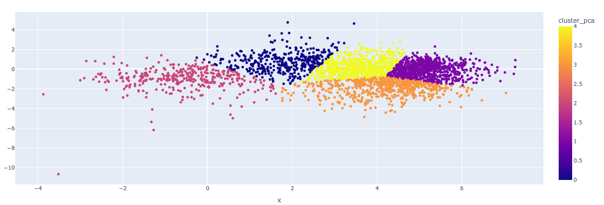

# 🎵 Music Matcher: Recomendador de Músicas com PySpark

Este projeto utiliza técnicas de Machine Learning para agrupar músicas por similaridade utilizando a base de dados do Spotify.
Este projeto é um motor de recomendação inteligente que utiliza processamento de Big Data e Machine Learning para agrupar músicas com base em suas características intrínsecas, indo além das classificações genéricas de gêneros musicais.

🛠️ Decisões de Engenharia (A História do Projeto)
Para construir este recomendador, foram tomadas decisões estratégicas para garantir precisão e eficiência:
1. O Problema: Além dos Gêneros
O desafio inicial era criar recomendações que não fossem baseadas apenas em nomes de gêneros, que são subjetivos e muitas vezes imprecisos. O objetivo foi focar em dados matemáticos puros — como energy (energia), danceability (dançabilidade), valence (positividade) e tempo — para encontrar músicas que realmente compartilham a mesma "alma" sonora.

2. O Ponto Chave: Otimização com PCA
Durante o desenvolvimento, percebi que trabalhar com 15 variáveis diferentes tornava o modelo mais pesado e suscetível a ruídos estatísticos. Para otimizar o processamento, optei por aplicar o PCA (Principal Component Analysis).

Com o PCA, consegui reduzir as 15 colunas originais para apenas 6 componentes principais.

Mantive cerca de 67% da variância total dos dados, garantindo que o modelo retivesse as informações mais importantes.

Isso permitiu um agrupamento muito mais veloz e focado no que realmente diferencia uma música de outra no espaço vetorial.

3. Estratégia de Clustering: A "Gaveta" Ideal
Para a segmentação das músicas, utilizei o algoritmo K-Means. A minha sugestão estratégica foi configurar o modelo com 50 clusters.

Por que 50? Esta escolha foi feita para equilibrar a especificidade e a variedade. Com 50 "gavetas" (clusters), as músicas ficam agrupadas em nichos bem definidos, permitindo que o usuário receba recomendações que façam sentido técnico, mas que também possibilitem a descoberta de novos artistas dentro do mesmo estilo matemático.

## 🚀 Tecnologias Utilizadas
* **PySpark** (Processamento de dados)
* **Scikit-Learn/PCA** (Redução de dimensionalidade)
* **K-Means** (Agrupamento/Clustering)
* **Matplotlib/Plotly** (Visualização)

## 🧠 Como funciona?
O modelo processa características como `acousticness`, `danceability` e `energy`. Através do PCA, reduzimos a complexidade e aplicamos o K-Means para criar 50 grupos distintos de músicas.

---
Projeto desenvolvido durante o curso de Data Science aplicada.
Desenvolvido por Tatiana 🚀
